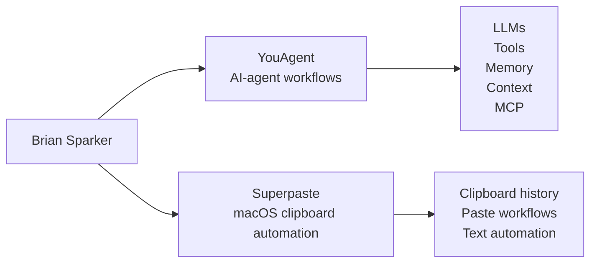

### Hi, I'm Brian 👋

**Product @ [you.com](https://you.com).** I build AI-agent infrastructure, MCP tools, and sharp macOS utilities for people who want their software to feel faster, cheaper, and more useful.

Right now my focus is split between **[YouAgent](https://github.com/brainsparker/youagent)**, AI-agent tooling for useful workflows with models, tools, memory, and context, and **[Superpaste](https://github.com/brainsparker/superpaste)**, a macOS clipboard utility for faster paste workflows.

My work clusters around two ideas: making AI agents **more capable and portable**, and removing **everyday friction** from the software people use all day.

#### 🔭 Current Focus

| Project | What I'm building |
| --- | --- |
| [YouAgent](https://github.com/brainsparker/youagent) | AI-agent tooling for workflows that combine LLMs, tools, memory, and user context |
| [Superpaste](https://github.com/brainsparker/superpaste) | A macOS productivity app for smarter clipboard history, paste workflows, and text automation |

#### 📦 More open source

| Project | What it does |
| --- | --- |
| [frugal](https://github.com/brainsparker/frugal) | Cost-optimized MCP server + proxy router that picks the cheapest model and toolchain for each task |
| [MCP-Profiles](https://github.com/brainsparker/MCP-Profiles) | Reusable, model-independent identity for AI agents via an MCP gateway |
| [you.md](https://github.com/brainsparker/you.md) | Open protocol for portable user preferences and context across AI-assisted dev tools |
| [PromptLens](https://github.com/brainsparker/PromptLens) | Lightweight prompt & agent evaluation tool |
| [free-mail-merge](https://github.com/brainsparker/free-mail-merge) | Upload a CSV → get a mail-merged PDF |
| [skills](https://github.com/brainsparker/skills) | GTM skills for product builders — positioning, messaging & narrative |

#### 🧰 Mostly working in
`Go` · `TypeScript` · `Python` · `Swift` · `MCP` · `LLMs` · `AI agents` · `macOS apps`

#### 🔗 Elsewhere
**[sparker.co](https://sparker.co)** &nbsp;·&nbsp; **[@PeerReview](https://x.com/PeerReview)** on X &nbsp;·&nbsp; building at **[you.com](https://you.com)**

<!-- Optional: one stats card, dark theme to match a dark profile. Delete these two lines if you want it cleaner. -->

